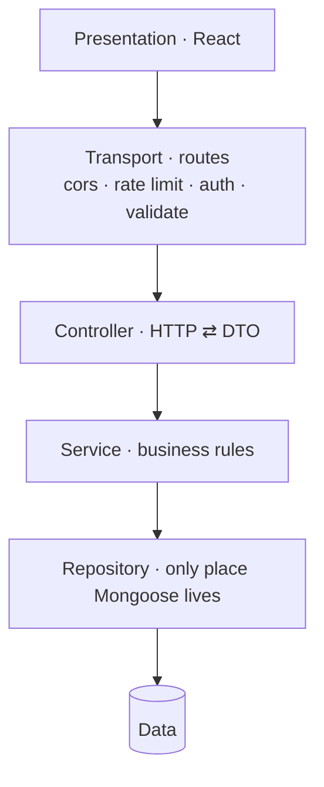

# Architecture Overview

## The defining fact

**There are two backends, and they are not the same backend.**

[[Server]] is well-built — layered, dependency-injected, validated config — and
handles roughly **4%** of the traffic surface. [[Client]] carries the rest
through Next.js API routes that historically had no authorisation layer, no
rate limiting and no validation layer.

Every Critical in [[Security Findings]] was on the client side. Every piece of
machinery needed to fix them already existed on the server side, unused.

```mermaid
graph LR
    subgraph "96% of traffic"
        C[Client API routes<br/>34 handlers]
    end
    subgraph "4% of traffic"
        S[Server /api/v1<br/>sponsorship only]
    end
    C --> DB[(MongoDB)]
    S --> DB
    style C fill:#3a2f1f,stroke:#c84
    style S fill:#1f3a2f,stroke:#4c8
```

## The direction

Finish the second architecture rather than design a third — see
[[ADR-001 Two Backends]].

## Layers (target)

One rule keeps it honest: **a layer may only call the one below it.** Enforce
with an ESLint `no-restricted-imports` rule — an unlinted convention decays.

## Related

[[Client]] · [[Server]] · [[Shared Package]] · [[Database]] · [[DataWeave Runtime]] · [[Decisions]]
