# DataWeave Runtime ⚠️

**The component that executes untrusted user code is not in this repository and
is not owned by this project.**

`https://dataweave-playground-h1p7.onrender.com` — third-party, Render free
tier, unversioned, no contract.

## Why this is now urgent

Before server-side grading it was a playground dependency. After
[[FEAT-01 Server-Side Grading]] moved verdicts onto the request path, it became
a hard dependency of the **core product loop**: if it is down, every submission
returns `Error`.

```mermaid
graph LR
    S[Submission] --> G[grading.ts]
    G --> RT{{Runtime<br/>sleeps after 15 min<br/>30–60s cold start}}
    RT --> V[Verdict]
    style RT fill:#3a1f1f,stroke:#c44
```

**15s timeout vs a 30–60s cold start** — the first submission after a quiet
period fails by arithmetic, not bad luck.

## Unanswerable questions

Isolation, cgroup limits, network egress, container escape — none can be
assessed, because the sandbox is not here. That is itself the finding.

## Mitigations shipped

- Live compile backs off after 2 consecutive transport failures
- A dead fallback URL was found and replaced ([[W1-R9 Dead Compiler URL]])

## Plan
`docs/audit/09-runtime-ownership.md` — Phase A (keep-warm, circuit breaker) is
1.5 days and separable.

## Related
[[FEAT-01 Server-Side Grading]] · [[Architecture Overview]] · [[Operations]]
