# Shared Package · @dwcode/shared

`packages/shared/` — domain rules used by **both** halves. No runtime deps: no
Mongoose, no React, no Express, no `process.env`.

Created by [[ADR-003 Difficulty Registry]] to end four separate copies of the
scoring tables.

## The registry

`src/difficulty.ts` is **one array**. Each tier carries id, order, scoreWeight,
coinReward, description and Tailwind classes. Everything derives from it:

```mermaid
graph LR
    REG[difficulty.ts<br/>one array] --> E[Mongoose enum]
    REG --> V[API validation]
    REG --> F[Filter bar]
    REG --> C[Badge colours]
    REG --> S[Leaderboard score]
    REG --> CO[Coin rewards]
    REG --> AI[AI prompt vocabulary]
    REG --> WC[Contest scoring text]
    style REG fill:#1f3a2f,stroke:#4c8
```

**Adding a tier is one entry.** Proven: `Expert` was added with no other file
changed.

## Two rules

1. **`id` is persisted** in `problems.difficulty`. Adding one is safe; renaming
   one is a data migration.
2. **Tailwind classes must be complete literals.** `text-${c}-500` is never
   generated. [[Client]]'s `@source` directive makes them visible to the scanner.

## Related
[[ADR-003 Difficulty Registry]] · [[ADR-004 npm Workspaces]] · [[Client]] · [[Server]]
