# DWCode — Project Hub

> Open `docs/vault/` as an Obsidian vault. Press **Ctrl/Cmd+G** for the graph
> view — the links below are its edges.

A LeetCode-style practice platform for **MuleSoft DataWeave**.
Live: https://dwcode.vercel.app · Repo: `bighnesh0007/dwcode`

## The system in one picture

```mermaid
graph TD
    U([Browser]) --> C[Client · Next.js<br/>Vercel]
    C -->|4 calls only| S[Server · Express<br/>Render]
    C -->|everything else| DB[(MongoDB Atlas)]
    S --> DB
    C --> RT{{DataWeave Runtime<br/>third-party}}
    S --> RT
    C -.imports.-> SH[[shared · domain rules]]
    S -.imports.-> SH

    style RT fill:#3a1f1f,stroke:#c44
    style SH fill:#1f3a2f,stroke:#4c8
    style DB fill:#1f2a3a,stroke:#48c
```

The red box is the one nobody here owns → [[DataWeave Runtime]]

## Start here

| | |
|---|---|
| How the system fits together | [[Architecture Overview]] |
| What's broken and what's fixed | [[Security Findings]] |
| Why things are the way they are | [[Decisions]] |
| Deploying, migrating, recovering | [[Operations]] |

## Components

[[Client]] · [[Server]] · [[Shared Package]] · [[Database]] · [[DataWeave Runtime]]

## Open right now

- [[Pending Migrations]] — four staged DB steps, **one is urgent**
- [[DataWeave Runtime]] — unowned third-party service on the critical path
- [[SEC-21 Move Auth Off Middleware]]
- [[FEAT-01 Server-Side Grading]] — hidden tests still not executed

## Source of truth

The vault *summarises and links*. The authoritative documents are:
`docs/audit/` (the audit), `docs/runbooks/` (procedures), `docs/plans/`.
