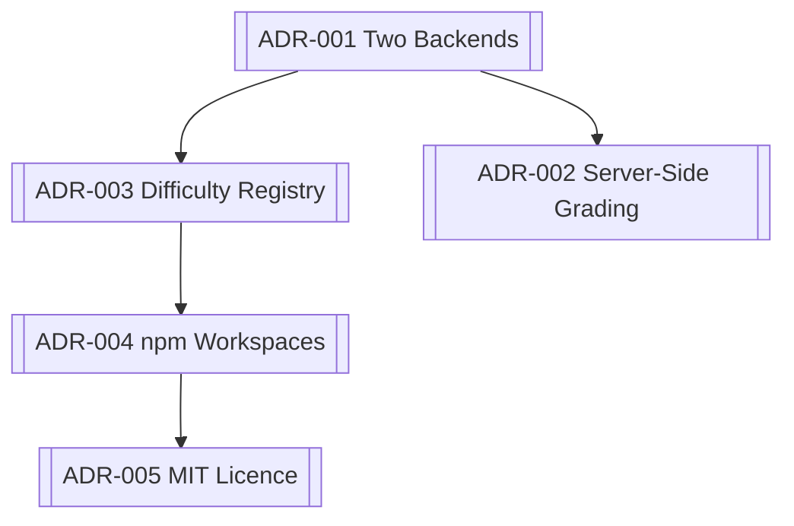

# Decisions

Why things are the way they are. Each note records the choice, the alternative,
and what it cost — so a future reader can tell a deliberate decision from an
accident.

- [[ADR-001 Two Backends]] — finish the second architecture, don't design a third
- [[ADR-002 Server-Side Grading]] — the browser cannot be the grader
- [[ADR-003 Difficulty Registry]] — one array, everything derives
- [[ADR-004 npm Workspaces]] — and the deployment bill it came with
- [[ADR-005 MIT Licence]] — "open source" was not legally true

## Related
[[DWCode]] · [[Architecture Overview]]
