# Security Findings

Full report: `docs/audit/02-security.md` (31 findings). This note is the map.

```mermaid
graph TD
    A[31 findings] --> C[5 Critical<br/>all CLOSED]
    A --> H[8 High<br/>6 closed · 2 partial]
    A --> M[11 Medium]
    A --> L[7 Low]
    C --> C1[[C-1 Unauthenticated Problem Write]]
    C --> C4[[C-4 Client-Side Grading]]
    H --> H1[[H-1 Stored XSS]]
    style C fill:#3a1f1f,stroke:#c44
```

## The two that mattered most

| | |
|---|---|
| [[C-1 Unauthenticated Problem Write]] | Anyone could `curl -X DELETE` the problem bank |
| [[C-4 Client-Side Grading]] | The browser decided its own verdict — every rank forgeable |

## Criticals — all closed

- [[C-1 Unauthenticated Problem Write]] — admin gate + field allowlist
- **C-2** unauthenticated AI generation on the platform's Gemini key → admin gate
- **C-3** notes were global *and* unauthenticated → owner-scoped ([[Pending Migrations]])
- [[C-4 Client-Side Grading]] → server-side verdicts
- **C-5** bulk solve forgery via guest migration → feature-flagged off

## Still open

- [[H-1 Stored XSS]] — mitigated, real sanitiser pending (SEC-11)
- **H-5** mass assignment — partial; zod validation pending (SEC-15)
- **H-3** rate limiting — needs Redis (FEAT-09)
- [[SEC-21 Move Auth Off Middleware]]
- [[W1-R8 Dependency CVEs]] — accepted with expiry

## What the pattern was

24 of 31 findings were in [[Client]]. Not coincidence: [[Server]] had an
authorisation middleware, a validation middleware and an error envelope; the
client re-implemented security per route, or didn't.

## Related
[[DWCode]] · [[Architecture Overview]] · [[Decisions]]
